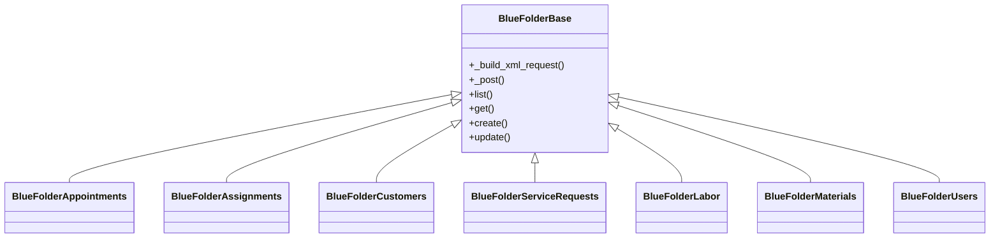

# BlueFolder API (Unofficial Python SDK)

A clean, object-oriented Python wrapper around the BlueFolder v2.0 API,  
built to simplify service management integrations such as routing extensions, ticket enrichment,  
and field technician automation.

---

## 🚀 Features

✅ Strongly-typed, modular domain classes  
✅ XML-based API request builder compliant with BlueFolder’s schema  
✅ Built-in session management via `requests.Session()` with configurable timeouts (30s default)  
✅ Consistent `.list()`, `.get()`, `.add()` patterns across all endpoints  
✅ Human-readable structured outputs (`dict` / `list`) instead of raw XML  
✅ Easily extendable for new BlueFolder domains  

---

## 🧩 Installation

```bash
pip install -r requirements.txt
```

Requirements:
- Python 3.10+
- `requests`
- `python-dotenv`
- `tenacity` (optional, for retries)
- `xml.etree.ElementTree` (standard library)

---

## ⚙️ Configuration

Create a `.env` file in your project root:

```env
BLUEFOLDER_API_KEY=your_api_key_here
BLUEFOLDER_ACCOUNT_NAME=your_account_name_here
# Optional overrides
# BLUEFOLDER_BASE_URL=https://custom-proxy.example.com/api/2.0
# BLUEFOLDER_ATTACHMENTS_BASE_URL=https://api.bluefolder.com/api/2.0
```
**Required**: `BLUEFOLDER_API_KEY`
**Optional**: `BLUEFOLDER_ACCOUNT_NAME`
*Optional*: `base_url` overrides account-derived URL. If you use a custom proxy or IP-based base URL, still set `BLUEFOLDER_ACCOUNT_NAME` because BlueFolder Basic auth uses the account name as the password component.

Optionally specify a custom `.env` path via:

```env
BLUEFOLDER_ENV_PATH=/path/to/.env
```

Authentication uses HTTP Basic with your API key as the username and `x` as the password, matching BlueFolder's official API examples. All calls use a default 30s timeout; override by passing `timeout=` into `BlueFolderBase` subclasses if you wrap or extend them, or set `BLUEFOLDER_TIMEOUT_SECONDS`.

Hardening knobs:
- `BLUEFOLDER_TIMEOUT_SECONDS`: request timeout in seconds
- `BLUEFOLDER_RETRY_TOTAL`: transient HTTP retry count for safe/read-style actions
- `BLUEFOLDER_RETRY_BACKOFF`: retry backoff base in seconds
- `BLUEFOLDER_RETRY_MUTATIONS=true`: allow retries for add/edit/delete style actions
- `BLUEFOLDER_EMPTY_RESPONSE_RETRY_TOTAL`: retry count for empty XML responses
- `BLUEFOLDER_HOST_HEADER`: optional upstream host header when routing through a proxy/IP
- `BLUEFOLDER_MAX_ATTACHMENT_BYTES`: maximum decoded upload size for attachments
- `BLUEFOLDER_DISABLE_GENERIC_HELPERS=true`: block legacy generic `get/list/create/update` helpers unless a domain overrides them with a documented payload shape

Attachments are served from a shared BlueFolder host by default (`https://api.bluefolder.com/api/2.0`). All other domains default to `https://app.bluefolder.com/api/2.0`, or `https://{account}.bluefolder.com/api/2.0` when `BLUEFOLDER_ACCOUNT_NAME` is set. If you need to route traffic differently, set `BLUEFOLDER_ATTACHMENTS_BASE_URL` (or `BLUEFOLDER_BASE_URL` for a global override) or pass `base_url` when instantiating `BlueFolderAttachments`.

You can configure the client either via `BLUEFOLDER_ACCOUNT_NAME`, by passing `base_url` explicitly, or by relying on the official shared host `https://app.bluefolder.com/api/2.0`. If `base_url` is a standard host like `https://myaccount.bluefolder.com/api/2.0`, the client can infer the account name from the URL. If `base_url` is a custom proxy, set `BLUEFOLDER_HOST_HEADER` when your proxy requires a specific upstream host header.

Some BlueFolder tenants do not expose every undocumented endpoint. This library now prefers the documented customer contact routes under `/customers/*Contact.aspx` and falls back to `/customers/get.aspx` when it needs to enumerate a customer's contacts.

For tenant-only SR status catalogs that are only exposed in the BlueFolder UI dropdown, use:

```bash
PYTHONPATH=. python scripts/update_status_inventory_from_html.py path/to/status_dropdown.html
```

You can also pipe the raw HTML snippet directly:

```bash
pbpaste | PYTHONPATH=. python scripts/update_status_inventory_from_html.py
```

The resulting `bluefolder_status_inventory.json` file is intentionally treated as a local tenant artifact, not library-owned source. The repo ships [bluefolder_status_inventory.example.json](/home/ner0tic/Documents/Projects/ARCoM/bluefolder-api/bluefolder_status_inventory.example.json) only as a schema hint.

The client now raises typed exceptions for common failure classes:
- `BlueFolderAuthError`
- `BlueFolderRateLimitError`
- `BlueFolderUnsupportedEndpointError`
- `BlueFolderInvalidResponseError`

```python
from bluefolder_api.client import BlueFolderClient

# Default env-based (needs BLUEFOLDER_API_KEY and BLUEFOLDER_ACCOUNT_NAME)
bf = BlueFolderClient()

# Explicit base URL for custom domains or overrides
bf = BlueFolderClient(base_url="https://myaccount.bluefolder.com/api/2.0")
```

---

## 🧱 Architecture Overview

Each BlueFolder domain (Appointments, Assignments, Customers, etc.)  
extends a common abstract base: `BlueFolderBase`.



All domain handlers are instantiated automatically through the main client:

```python
from bluefolder_api.client import BlueFolderClient

bf = BlueFolderClient()

# Example: List active users
users = bf.users.list_active()
print(users)

# Example: Get today’s service requests for a technician
requests = bf.service_requests.list_for_user_range(
    user_id=33538043,
    start_date="2025.11.07 12:00 AM",
    end_date="2025.11.07 11:59 PM",
    date_range_type="dateTimeCreated"
)
```

---

## 🧩 Domain Coverage

| Domain | Class | Notes |
|---------|--------|-------|
| 🕓 **Appointments** | `BlueFolderAppointments` | list, get, add, edit |
| 🔧 **Assignments** | `BlueFolderAssignments` | list by user/date |
| 📄 **Service Requests** | `BlueFolderServiceRequests` | list/get, add/edit/delete, assignment add/edit/delete/complete, comments/labor/materials add/edit, history |
| 👥 **Customers** | `BlueFolderCustomers` | list, add/edit/delete, get; contacts/locations add/edit/delete/get |
| 🏠 **Customer Locations** | `BlueFolderCustomerLocations` | list/get, add/edit/delete |
| 🧰 **Equipment** | `BlueFolderEquipment` | get/list, add/edit, list_all, custom fields |
| 🧾 **Materials** | `BlueFolderMaterials` | list/add for SR |
| ⏱️ **Labor** | `BlueFolderLabor` | list/add for SR |
| 💵 **Expenses** | `BlueFolderExpenses` | list/add for SR |
| 📎 **Attachments** | `BlueFolderAttachments` | list/add/download/delete for SR |
| 💬 **Comments** | `BlueFolderComments` | list/add for SR |
| 📋 **Contracts** | `BlueFolderContracts` | list (by customer), get |
| 🧮 **Custom Fields** | `BlueFolderCustomFields` | list |
| 🧾 **Item Lists** | `BlueFolderItemLists` | list price lists, get items |
| 🛒 **Items** | `BlueFolderItems` | list/get, add/edit/delete |
| 💰 **Tax Codes** | `BlueFolderTaxCodes` | list |
| 👤 **Users** | `BlueFolderUsers` | list/list_active, get, add/edit |

---

## 🧠 Usage Examples

### Get Today’s Assignments for a Technician

```python
from bluefolder_api.client import BlueFolderClient
from datetime import date

bf = BlueFolderClient()

today = date.today().strftime("%Y.%m.%d")
assignments = bf.assignments.list_for_user_range(
    user_id=33538043,
    start_date=f"{today} 12:00 AM",
    end_date=f"{today} 11:59 PM",
    date_range_type="scheduled"
)

for a in assignments:
    print(a["assignmentId"], a["serviceRequestId"], a["start"])
```

---

### Retrieve Enriched Service Request with Customer Location

```python
bf = BlueFolderClient()

sr_list = bf.service_requests.list_for_user_range(
    33538043,
    "2025.11.07 12:00 AM",
    "2025.11.07 11:59 PM",
    date_range_type="dateTimeCreated"
)

for sr in sr_list:
    locs = bf.customer_locations.get_by_customer_id(sr["customerId"])
    if not locs:
        continue
    loc = locs[0]
    print(f"{sr['subject']} — {loc['address']}, {loc['city']}")
```

---

### Add a Material to a Job

```python
bf.materials.add_to_service_request(
    service_request_id=91800,
    item_name="Condenser Fan Motor",
    quantity=1,
    unit_price=225.00,
    description="OEM motor replacement"
)
```

---

### Add a Comment to a Service Request

```python
bf.comments.add_to_service_request(
    service_request_id=91800,
    text="Job completed successfully; parts verified.",
    visible_to_customer=True
)
```

---

## 🧩 Integration Example: Routing Manager

The `optimized-routing-extension` project consumes this API to build  
Google Maps route URLs from BlueFolder assignment data:

```python
from bluefolder_integration import BlueFolderIntegration
from routing import generate_google_route

bf = BlueFolderIntegration()
assignments = bf.get_user_assignments_today(user_id=33538043)
route_url = generate_google_route(
    user_id=33538043,
    origin_address="180 E Hebron Rd, Hebron, ME"
)
print(route_url)
```

---

## 🧱 Project Structure

```text
bluefolder_api/
│
├── base.py                # Common XML builder and HTTP helpers
├── client.py              # Central client that instantiates all domains
├── appointments.py
├── assignments.py
├── attachments.py
├── comments.py
├── contracts.py
├── custom_fields.py
├── customer_contacts.py
├── customer_locations.py
├── customers.py
├── equipment.py
├── expenses.py
├── item_lists.py
├── labor.py
├── materials.py
├── service_requests.py
├── tax_codes.py
└── users.py
```

---

## 🧰 Contributing

1. Fork the repo and create a new branch.
2. Add new domain modules by extending `BlueFolderBase`.
3. Follow existing code style and docstring format.
4. Submit a pull request with your API logs (if adding new endpoints).

---

## 🧾 License

This SDK is provided under the **MIT License**.  
It is an independent, unofficial wrapper — not affiliated with BlueFolder, Inc.

---

## 🧭 Versioning

| Version | Date | Notes |
|----------|------|-------|
| `1.1.3` | Dec 2025 | Base URL override support in the client, optional retry deps for lightweight installs/tests, refreshed docs/tests |
| `1.1.1` | Nov 2025 | Expanded endpoint coverage: service request add/edit/delete + assignments/comments/labor/materials/history, appointments add/edit/get, attachments download/delete, customers/contacts/locations CRUD, users add/edit, equipment/items CRUD, consolidated tests |
| `1.0.0` | Nov 2025 | Full v2.0 API domain coverage and tested integration with routing |
| `0.9.0` | Oct 2025 | Added assignments + service request enrichment |
| `0.8.0` | Sep 2025 | Initial structure and dotenv integration |
